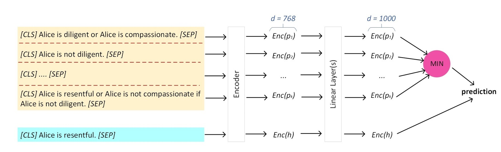
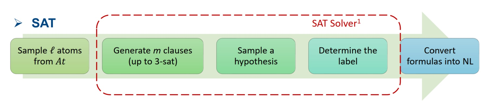

# Can Language Models Learn Embeddings of Propositional Logic Assertions?

## Quick links

* [Overview](#overview)
* [Requirements](#requirements)
* [Prepare the data](#prepare-the-data)
* [Train the model](#train-the-model)

## Overview
This project provides code implementations for reproducing the encoding strategies described in our [paper](https://aclanthology.org/2024.lrec-main.246/). The experimental code is located in the `./src` directory. The encoding strategies codes include:

1. **Finetuning Joint Encoder**: This strategy jointly encodes the premises and hypothesis, following the approach used in [Clark et al., 2020](https://www.ijcai.org/proceedings/2020/537); [Richardson and Sabharwal, 2022](https://ojs.aaai.org/index.php/AAAI/article/view/21371); [Zhang et al., 2023](https://www.ijcai.org/proceedings/2023/375).
2. **Finetuning Bi-encoder**: This uses the Order Embeddings loss function from [Vendrov et al., 2016](https://arxiv.org/abs/1511.06361). Variations of this model include 0L, 1L, and 2L, indicating the number of hidden layers before the classification layer. These hidden layers transform the encoding dimensions to the desired size, such as 768 and 1000.
3. **Finetuning Joint Premises Order Embeddings** with tied parameters.
4. **Finetuning Joint Premises Order Embeddings** with different parameters.
5. **Finetuning Joint Premise Bi-Encoder**: This implementation uses BCE Loss.

**Joint Encoder vs. Bi-Encoder**
The main difference between the Joint Encoder and Bi-Encoder lies in how premises and hypotheses are fed into the model. The Joint Encoder concatenates the set of premises and a hypothesis into a single input sequence. However, in the Bi-Encoder, each premise is encoded separately and then aggregated using min-pooling to construct a single embedding representing all the information in the premises before concatenating with the hypothesis embedding. The following image illustrates the embedding mechanism in the Bi-Encoder.


## Requirements
To run the code, please install all the dependencies using the following command:
```
pip install -r requirements.txt
```

## Prepare the data
The dataset used in this project can be downloaded [here](https://drive.google.com/file/d/1EhJmni2ptdZzYj3RM5JLQ-obfLivb1jn/view?usp=sharing). Please download the dataset and extract all the files into the `./dataset/` directory.

The dataset is divided into two main parts: `train_set` and `test_set`. Fine-tuning the model requires the dataset located in `./dataset/train_set`, with folder names corresponding to the captions of the tables and figures in the paper. For example, to reproduce Table 1, use the dataset in the folder `./dataset/training_set/Table_1` to fine-tune the model and in `./dataset/test_set/Table_1` to test the model that has been trained using the corresponding dataset.

**Dataset Distribution**

To test the robustness of the approach method, we implemented three different dataset distributions: **SAT**, **Rule Priority (RP)**, and **Label Priority (LP)**. The SAT dataset was developed by randomly selecting literals to form a formula, which we then labeled by testing the satisfiability of the formula using an [SAT Solver](http://www.sat4j.org/). We referred to the original paper on implementing RP and LP and used the resources at the following [repo](https://github.com/joshuacnf/paradox-learning2reason). To control the complexity level of each problem instance, we used parameters such as the number of literals, the number of vocabularies used to translate each literal into natural sentences, and the number of premises. We used the same parameters to generate SAT, RP, and LP data. The detail configuration for each test scenario is explained in Section 5 of our paper.


## Train the model
### Script example
We trained all models with an effective batch size of 8/16/32. The scripts below show how to train bert_base_uncased on generated SAT to reproduce the result in Table 1.
```
#!/bin/bash

python ft_order_emb_0L.py \
--dataset SENT_5-9vars_1-10clauses_100K_1-3sat_hy_25_ER \
--dataset_path dataset/train_set/Table_1/ \
--batch_size 16 \
--lm_version bert_base_uncased

```
The code sets all parameter configurations used in the experiments. We only need to change the dataset, dataset_path, batch_size, and desired language model for each scenario.


